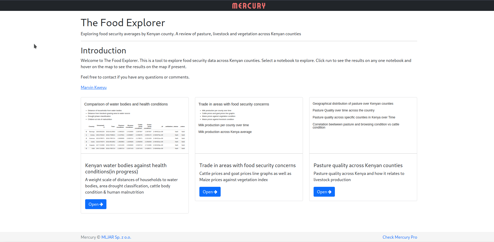

# FoodKenya

> An analysis of food security in Kenya in areas whose effects would be felt across the country




## Development setup

## Bare metal

Set up the local environment and start the server
```bash
bash develop.sh
```


## Docker setup(WIP)


```bash
docker run -p 8888:8888 -v $(pwd):/home/joyvan/work jupyter/scipy-notebook

```